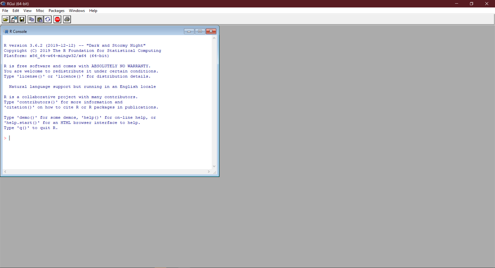

```{r setup, include=FALSE}
knitr::opts_chunk$set(echo = FALSE)
```


# Today's Session

Slides and materials are available to download at: https://osf.io/aqsm5/

## We will cover:

How to install R and R Studio.

The basics of R.

The benefits of using R Markdown versus typical R scripts for analysis.

How to effectively back up your work via Git Hub.

## This session will NOT:

Be a comprehensive guide for how to do every type of analysis in R (this would be impossible in one session). **HOWEVER**, once you have the basics down, R becomes relatively easy to use.


# Software set up

:::::::::::::: {.columns}
::: {.column}
## On a personally owned machine:
Download and install the latest version of the R language from https://www.r-project.org/

Download and install the latest version of R Studio from https://rstudio.com/

Download and install the latest version of Git Hub Desktop from:https://desktop.github.com/

Create a Git Hub account and log in.
:::
::: {.column}
## On a university owned machine:

Open AppsAnywhere in a web browser by navigating to https://appsanywhere.port.ac.uk/

Log in with your university credentials.

On the top right, use the "Search Apps" box to search for R Studio.

Press the green "Launch" button. 

Repeat this process but this time search for "Git Hub Desktop".

Create a Git Hub account and log in.
:::
::::::::::::::


# Basics of R

Before we start, who has used R before?


# Basics of R

R is a *programming language* which was originally created by Ross Ihaka and Robert Gentleman  at the University of Auckland, New Zealand.

Version 1 (v1.0) was released in Febuary 2000

Since then, it has become a popular choice for data analysis in both academia and industry.


# The Growth of R


# The Growth of R


# Benifits of R

**R is Open Source.** This enables rapid development and facilitates transparency.

**R is Free.** Benefiting you and your institution.

**R is Cross-platform.** Working on both Windows, Mac, and Linux.

**R is Scalable.** Allowing for analysis of big data.

**R is Fast.** You no longer have to endure the slow start up time of SPSS.

**R is Versatile.** It can be used for data analysis, the creation of documents, websites, and presentations.


# For instance... 


# CRAN

As anyone can create an R package (more on this later), some people (rightly) worry that any analysis carried out in R could contain errors, and therefore opt to stick to "their tried and trusted" proprietary software.

Thankfully, The Comprehensive R Archive Network (CRAN) exists as a regulatory body for R packages (similar to the academic peer review system).

Nevertheless, like the peer review system, some unrelable work can "slip through the net". Therefore, we recommend using popular and highly trusted packages wherever possible.


# Base R



# R Studio


# How to use R
The following slides about the basics of R are based upon the tutorial provided by Dr Sam Robson (Pharmacy and Biomedical Sciences, University of Portsmouth). 

Sam's original work can be found here: https://uopbioinformatics.github.io/resource/rtutorial/


# The R Console
The command line is shown by the `>` character. Simply type your command here and press return to see the results. If your command is not complete, then the command line character will change to a `+` to indicate that more input is required, for instance a missing parenthesis:

```{r warning1, eval=FALSE, warning=TRUE, include=TRUE, echo=TRUE}
print ("Hello World!"
```

```{r warning2, eval=FALSE, warning=TRUE, include=TRUE, echo=TRUE}
## Error: <text>:2:0: unexpected end of input
## 1: print ("Hello World!"
##    ^
```


# Variables
R stores “variables” using names made up of characters and numbers. A variable, as the name suggests, is a data “object” that can take any value that you want, and can be changed.

The variable name can be anything that you like, although it must begin with a character.

Whilst it is perfectly acceptable to use simple variable names such as `x`, `y`, `i`, we recommend using a more descriptive name (e.g. `participant_height` instead of `x`).


# Variables
To assign a value to the variable, use the `<-` command (less-than symbol followed by minus symbol). You can also use the `=` symbol, but this has other uses (for instance using `==` to test for equality) so it is better to use the `<-` command:

```{r echo=TRUE}
x <- 3
x # Returns the value stored in 'x' - currently 3
```

```{r echo=TRUE}
x <- 5
x # Returns the value stored in 'x' - now 5
```


# Simple Arithmetic
Simple arithmetic can be performed using the standard arithmetic operators (+, -, *, /), as well as the exponent operator (^). There is a level of precedence to these functions – the exponent will be calculated first, followed by multiplication and division, followed by plus and minus. For this reason, you must be careful that your arithmetic is doing what you expect it to do. You can get around this by encapsulating subsets of the sum in parentheses, which will be calculated from the inside out:
```{r echo=TRUE}
1+2*3 
```

```{r echo=TRUE}
(1 + 2) * 3 
```

```{r echo=TRUE}
1 + (2 * 3) 
```


# Simple Arithmetic
You can also use other variables in these assignments:
```{r echo=TRUE}
x <- 1
y <- x
y
```

```{r echo=TRUE}
z <- x + y 
z
```


# Data Classes
Variables can take many forms, or “classes”. The most common are “numeric” (which you can do numerical calculations on), character (can contain letters, numbers, symbols etc., but cannot run numerical calculations), and logical (TRUE or FALSE). The speech marks character `"` is used to show that the class of `y` is “character”. You can also use the apostrophe `'`. There is a difference between these, but for now this is not important. You can check the class of a variable by using the `class()` function:
```{r echo=TRUE}
x <- 12345
class(x)
```

```{r echo=TRUE}
y <- "12345"
class(y)
```


# Data Classes
Addition is a well-defined operation on numerical objects, but is not defined on character class objects. Attempting to use a function which has not been defined for the object in question will throw an error:
``````{r eval=FALSE, warning=TRUE, include=TRUE, echo=TRUE}
x <- "12345"
x+1
## Error in x + 1: non-numeric argument to binary operator
```

You can also change the class of a variable by assigning to the `class()` function:
```{r echo=TRUE}
class(x) <- "numeric" 
class(x)
```

```{r echo=TRUE}
x+1
```


# Data Classes
The other important data class is “logical”, which is simply a binary TRUE or FALSE value. There are certain operators that are used to compare two variables. The obvious ones are “is less than” (`<`), “is greater than” (`>`), “is equal to”" (`==`). You can also combine these to see “is less than or equal to” (`<=`) or “is greater than or equal to” (`>=`). If the statement is true, then it will return the output “TRUE”. Otherwise it will return “FALSE”:
```{r echo=TRUE}
x <- 2
y <- 3
x <= y
```

```{r echo=TRUE}
x >= y
```


# Data Classes
You can also combine these logical tests to ask complex questions by using the “AND” (`&&`) or the “OR” (`||`) operators. You can also negate the output of a logical test by using the “NOT” (`!`) operator. This lets you test for very specific events in your data. Again, we recommend using parentheses to break up your tests to ensure that the tests occur in the order which you expect:
```{r echo=TRUE}
x <- 3
y <- 7
z <- 6
(x <= 3 && y >= 8) && z == 6 
```

```{r echo=TRUE}
(x <= 3 && y >= 8) || z == 6 
```


# Vectors
Single values are all well and good, but R has a number of ways to store multiple values in a single data structure. The simplest one of these is as a “vector” – simply a list of values of the same class. You create a vector by using the `c()` (concatenate) function:
```{r echo=TRUE}
my_vector <- c(1,2,3,4,5) 
my_vector
```


# Vectors
This is a very useful way of storing linked data together. You can access the individual elements of the vector by using square brackets (`[`]) to take a subset of the data. The elements in the vector are numbered from 1 upwards, so to take the first and last values we do the following:
```{r echo=TRUE}
my_vector[5]
```


```{r echo=TRUE}
my_vector[6]
```

As you can see, a value NA (Not Applicable) is returned if you try to take an element that does not exist. 


# Vectors
The subset can be as long as you like, as long as it’s not longer than the full set:
```{r echo=TRUE}
my_vector[1:4]
```

Here, the `:` in the brackets simply means to take all of the numbers from 1 through to 4, so this returns the first 4 elements of the vector. For instance, this is a simple way to take the numbers from 1 to 20:
```{r echo=TRUE}
1:20
```


# Vectors
To drop elements from an array, you use the minus symbol:
```{r echo=TRUE}
my_vector
```

```{r echo=TRUE}
my_vector[-1]
```

```{r echo=TRUE}
my_vector[-c(1,3,5)]
```


# Vectors
You can give names to the values in a vector or in a list by using the names() function to make it easier to follow what the values are:
```{r echo=TRUE}
my_vector        <- c(1:5)
names(my_vector) <- c("length", "width", "height", "weight", "age")
```

You can use these names instead of the reference number to subset lists and vectors:
```{r echo=TRUE}
my_vector["age"]
```


# Vectors
The number of values in a vector or list can be found by using the length() function:
```{r echo=TRUE}
my_vector <- 1:5 
length(my_vector)
```


# Vectors
We can also sort the data simply using the `sort()` function. If we want to get the indeces of the sorted vector (for instance to order a second vector based on the values in the first), we can use the `order()` function:
```{r echo=TRUE}
## Some values and their corresponding names
my_vals  <- c( 0.2, 1.7, 0.5, 3.4, 2.7 ) 
my_names <- c("val1", "val2", "val3", "val4", "val5")
```

```{r echo=TRUE}
my_sorted <- sort(my_vals)  ## Returns the values in sorted order
my_sorted
```

```{r echo=TRUE}
my_order  <- order(my_vals) ## Returns the indeces of the sorted values
my_order
```


# Lists
Another data structure that is very useful is the “list”. A list contains a number of things in a similar way to the vector, but the things that it contains can all be completely different classes. They can even be vectors and other lists (a list of lists).


# Lists
For example:
```{r echo=TRUE}
my_list <- list(12345, "12345", c(1,2,3,4,5)) 
my_list
```


# Lists
To subset a list, the syntax is slightly different and you use double square brackets:
```{r echo=TRUE}
my_list[[3]]
```


# Lists
If your list contains lists or vectors, you can subset these as well by using multiple sets of square brackets:
```{r echo=TRUE}
my_list <- list(12345, "12345", c(1,2,3,4,5)) 
my_list[[3]][5]
```


# Functions
R also uses functions (also known as methods, subroutines, and procedures) which simply take in one or more values, do something to them, and return a result.


# Functions
A simple example is the `sum()` function, which takes in two or more values in the form of a vector, and returns the sum of all of the values:
```{r echo=TRUE}
my_vector <- 1:5
my_vector
```

```{r echo=TRUE}
sum(my_vector)
```


# Functions
Sometimes functions take more than one variable (also known as “arguments”). These are named values that must be specified for the function to run. For example, the `cor()` function returns the correlation between two vectors. This requires several variables to be supplied – two vectors, `x `and `y,` of equal length – and you can also supply a number of additional arguments to control how the function works, including the method argument, which lets you specify which method to use to calculate the correlation:
```{r echo=TRUE}
sample1 <- c(0.9, 1.2, 8.9, -0.3, 6.4)
sample2 <- c(0.6, 1.3, 9.0, -0.5, 6.2)
cor(sample1, sample2 , method = "pearson")
```

```{r echo=TRUE}
cor(sample1, sample2 , method = "spearman")
```


# Functions
Note that we gave a name to the third argument (“method”), but not the first two. If you do not name arguments, they will be taken and assigned to the arguments in the order in which they are input. The first two arguments required by the function are `x` and `y` – the two vectors to compare. So there is no problem with not naming these (although you could, if you wanted to, say `x=sample1`, `y=sample2`). Any arguments not submitted will use their default value. For instance, the Pearson correlation is the default for method, so you could get this by simply typing:
```{r echo=TRUE}
cor(sample1, sample2)
```


# Functions
However, there is another argument for cor(), use, for which we are happy to use the default value before we get to method. We therefore need to name method to make sure that “pearson”" is not assigned to the use argument in the function. It is always safer to name the arguments if you are unsure of the order. You can check the arguments using the `args()` function:
```{r echo=TRUE}
args(cor)
```


# Functions
If you want to find out what a function does, there is a lot of very helpful documentation available in R. To see the documentation for a specific function, use the help() function. If you want to try and find a function, you can search using a keyword by using the help.search() function:
```{r eval=FALSE, echo=TRUE}
help(cor)
?cor # Alternative for help() 

help.search("correlation")
??correlation # Alternative for help.search()
```


# Installing Packages
Base R contains a large number of commonly used functions. There are also additional functions available in other “packages” that you can get hold of from the Comprehensive R Archive Network. To install a package, use the `install.packages()`. Note that the name of the package must be contained with speech marks (`"`).
```{r eval=FALSE, echo=TRUE}
# example
install.packages("tidyverse")
```

Once a package is downloaded, you need to make it avalible to your current R session by using the `library()` function:
```{r eval=FALSE, echo=TRUE}
library(tidyverse)
```

Note how the libary function does not require speech marks (yes, R can be strange).


# Data Frames
Data frames are the most powerful data types in R. They look similar to matrices, but the data structure is actually more similar to a list of vectors (all of the same length). The simplest way to think of them is as being similar to spreadsheets in Excel.

You can create data frames either in a similar way to how you create a list, or also by converting a matrix object:
```{r echo=TRUE}
data.frame(c(1:3), c(4:6), c(7:9), c(10:12)) 
```


# Data Frames
Notice how, in the second data frame, no column names are specified so R sets the defaults as V1, V2, V3, etc. Whilst data frames do have row names, it is the column names that are the most important. As with lists, these can be changed by using the names() command:
```{r echo=TRUE}
my_df <- as.data.frame(matrix(1:12, nrow = 3, ncol = 4)) 
names(my_df) <- c("val1", "val2", "val3", "val4")
my_df
```


# Data Frames
You access the elements of a data frame either using single square bracket notation in the same way as for a matrix, or you can access the individual columns using double square bracket notation in the same way as for lists. You can also access the individual columns by using the special `$` operator which is specifically used for data frames.


# Data Frames
Example 1
```{r echo=TRUE}
sub_df <- my_df[1:2, 3:4]
sub_df
```


# Data Frames
Example 2
```{r echo=TRUE}
val1 <- my_df[[1]]
val1
```


# Data Frames
Example 3
```{r echo=TRUE}
val2 <- my_df[["val2"]] 
val2
```


# Data Frames
Example 4
```{r echo=TRUE}
val3 <- my_df$val3
val3
```


# Data Frames
The beauty of data frames is that the data frame columns can be dealt with as if they were individual variables. For this reason, the column names must be suitable variable names (i.e. alphanumeric and not starting with a number) and must be unique. If you attach a data frame, you can access the columns as if they were variables:
```{r echo=TRUE}
my_df
```

```{r echo=TRUE}
my_df$val1 + 1000
```


# Reading and Writing Data
R can handle many file types including CSV, Excel, SPSS, JASON etc. The easiest way to read data into R is to use the "Import Dataset" button in R studio.


# Reading and Writing Data


# Reading and Writing Data


# Reading and Writing Data


# Reading and Writing Data


# Reading and Writing Data
The easiest way to write data from R is to use the `write.csv()` function. The first argument of this function is the object you would like to write to a `.csv`, followed by what you would like to name the file surrounded by speech marks:
```{r eval=FALSE, echo=TRUE}
write.csv(mydata, "mydata.csv")
```


# Some Simple Statistics
R is mainly designed for easy computation of statistics and there are many in-built functions and additional libraries that allow you to carry out most tasks. Most simple statistics can be easily calculated using in-built functions.

The following example creates a vector of 100 random values sampled from a normal distribution with mean 0 and standard deviation 1, basic summary statistics are calculated on subsequent slides:
```{r, echo=TRUE}
x <- sort(rnorm(100, mean = 0, sd = 1))
```


# Some Simple Statistics
```{r echo=TRUE}
min(x) # Find the minimum value
```

```{r echo=TRUE}
max(x) # find the maximum value
```

```{r echo=TRUE}
mean(x) # find the mean value
```

```{r echo=TRUE}
median(x) # find the median value
```

```{r echo=TRUE}
sd(x) # find the standard deviation
```


# Some Simple Statistics
The `summary()` function will calculate many of these basic statistics for you:
```{r echo=TRUE}
summary(x)
```


# Some Simple Statistics
Similarly, the `describe()` function from the `psych` package give you a detailed overview of the data including values for the skewness and kurtosis:
```{r echo=TRUE}
library(psych)
describe(x)
```


# Some Simple Statistics
A histogram of the values stored in `x` can be created using the `hist()` function.
```{r echo=TRUE}
hist(x)
```


# Some Simple Statistics
A boxplot of the values stored in `x` can be created using the `hist()` function.
```{r echo=TRUE}
boxplot(x)
```


# R Scripts Vs R Markdown
:::::::::::::: {.columns}
::: {.column}
## R Scripts

Can only contain code.

Organised into sections (`CTRL + R`).

Canot be compiled.
:::
::: {.column}
## R Markdown

Can contain code alongside text.

Organised into chunks (`CRTL + ALT + I`)

Can be compiled into PDF documents, Word documents, Presentations etc.
:::
::::::::::::::


# Over to you...

## Go to https://osf.io/mhwqz/ and download the worksheet.

* Get into groups containing complete beginners and more experienced R users. 

* Help each other out.

* Ask us.

**DON'T BE AFRAID TO USE GOOGLE**


# Introduction Git
https://git-scm.com/about

Git is an open source command line version control system, primarily used by software creators manage their projects. 

You can use it to back up and share your work via tools such as Git Hub, Git Lab, and Bitbucket.

We have chosed to use Git Hub due to the easy to use (and available on AppsAnywhere) Git Hub Desktop.


# Introduction to Git Hub


# Git Hub Desktop


# Git Hub Desktop


# Thanks


Renan Saraiva (renan.saraiva@port.ac.uk)

James Clay (james.clay@port.ac.uk)


